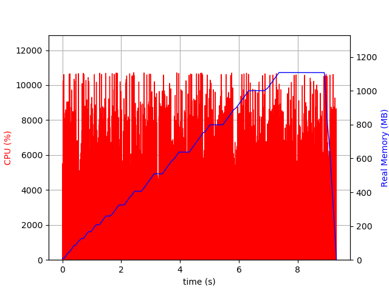
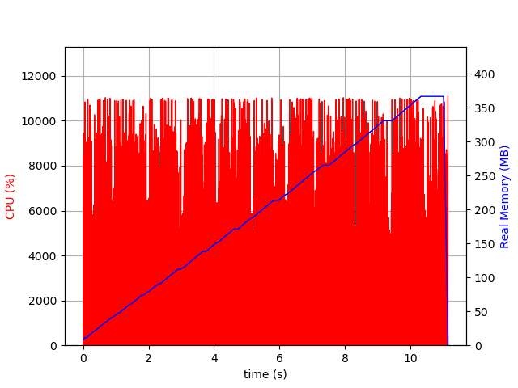

# Flyweight Demo
This is a demo of the flyweight design pattern written in python.

## How to use
The code is inspired from refactor.guru, to use it clone the repo and install the dependencies using pipenv

```
pipenv install
pipenv shell
psrecord "python without-flywight.py" --plot withoutfw.png
psrecord "python with-flywight.py" --plot withfw.png
```

## Results

Without Flyweight:



With Flyweight:


